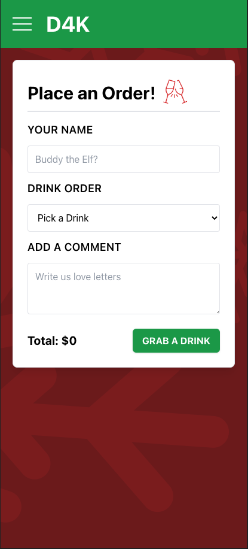
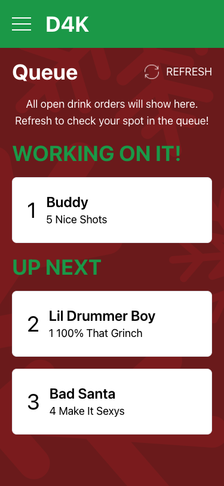
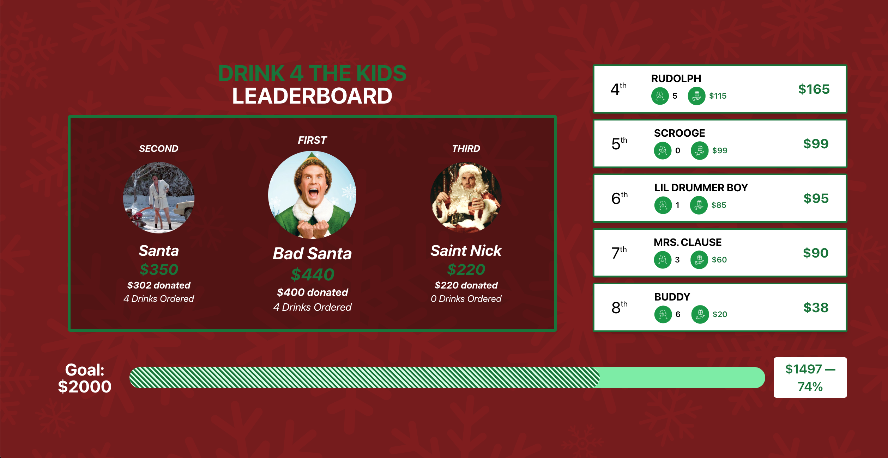

# DRINK 4 THE KIDS 2023 v1.0 [(Website)](https://d4k2k23.web.app/)

### *A web app to for the 4th annual D4K charity party.*  

All proceeds will go directly to The Nicholas House — An Atlanta based charity that operates an emergency shelter, as well as apartment sites for homeless families.
This year's goal is to raise $2,000.

# Demo 

## Menu
- Displays all available drink options
- Redirects to Order Page with drink preselected

## Order
- Stores username in local storage after order is submitted
- Has front and backend validation to prevent incomplete/incorrect submissions
- Allows for users to submit donations 
- Calculates user's total and saves to database
- Redirects to Queue after order is submitted

## Donate
- Stores username in local storage after donation is submitted
- Has front and backend validation to prevent incomplete/incorrect submissions
- Has preset donation amounts and allows for users to submit their own amount

## Queue
- Shows what drinks are being worked on and where a user is in line
- If a user's order is 3rd in line or later, allows a user to delete their order

## Mobile Leaderboard
- Shows goal (*$2000*), current total, and percentage of goal hit
- Automatically refreshes every 30 seconds

## Large Leaderboard
- Displayed on tv at party
- Shows goal (*$2000*), current total, and percentage of goal hit
- Automatically refreshes every 30 seconds

## Closing Tabs
- Aggregates user's orders and donations to a grand total
- Auto-populates amount for different payment methods (CashApp, PayPal, Venmo)

# Admin Pages

## Orders
- Shows orders and donations, ordered by when they were submitted
- Allows for admins to change order status in the database (complete/incomplete/paid/unpaid)
- Admins can delete orders or update donation amounts

## Donations

## Tabs
- Shows tab information for everyone at the party, grouped by username
- Allows for admins to add donations to user tabs
- Can mark tabs or donations as paid and set a user's tab to $0

