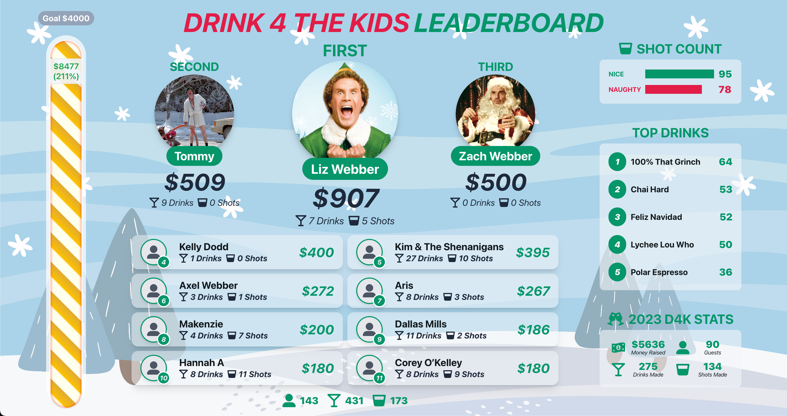

# DRINK 4 THE KIDS 2024 v3.0 [(Video Walkthrough)]()
### *A web app to help celebrate the 5th annual D4K charity party.* 

This year, we partnered with two Atlanta based charities, The Nicholas House and True Change. We raised our goal from $2,500 to $4,000 this year and, once again, we doubled our goal with a grand total of **$9,808** raised! With corporate matches, we were able to donate more than **$27,000** in total.

### **206 Unique Users, 494 Orders Placed, 624 Drinks Made**

## Tech Stack PERN
- React Frontend
- Express & Node Backend
- Google Cloud SQL Database

## Demo

### Home
- Provides quick links to the charities we work with, as well as our sponsors
- This year, we were fortunate enough to be sponsored by Ganji ATL, Minwha Spirits, Moxie — Candler Park, King Cube Ice, and Zaxby's

### Info
- Our FAQ page, providing all the necessary info to our guests
- Highlights the charities we work with, the parking situation and recommended dress code

### Menu
- Displays all available drink options
- Redirects to Order Page with drink preselected

### Order
- Stores username and user id in local storage after order is submitted
- Has front and backend validation to prevent incomplete/incorrect submissions
- Allows for users to submit custom donations, calculates user's total and saves to database
- Redirects to Queue after order is submitted

### Queue
- Shows what drinks are being worked on and where a user is in line
- If a user's order is 3rd in line or later, allows a user to delete their order

### Mobile Leaderboard
- Shows goal (*$4000*), current total, and percentage of goal hit
- Shows total users and a live drink/shot count
- Shows top ten users in terms of tabs paid, also shows each user their rank if they're not in the top 10

### Large Leaderboard
- Displayed on tv at party
- Shows goal (*$4000*), current total, and percentage of goal hit
- Shows live stats that update every 5 minutes (top drinks, top spirits, and a live naughty vs nice shot count)
- Features final stats from the previous year's party to compare throughout the night

### Closing Tabs
- Aggregates user's orders and donations to a grand total
- Auto-populates amount, username, and active order details for the user 
- Allows user to upload an image to be featured on leaderboard
- Allows user to pay with 3 different payment methods (CashApp, PayPal, Venmo) with the ammount and comment prepopulated with their order(s) information

## Admin Pages

### Orders
- Shows orders sorted by when they were submitted
- Allows for admins to change order status in the database (complete/incomplete/paid/unpaid)
- Admins can void orders, update tip amounts, and assign bartenders to specific orders

### Tabs
- Shows unpaid tab information for everyone at the party, grouped by username
- Allows for admins to adjust overall donations on a user' tabs
- Can mark tabs as paid and set a user's tab to $0

### Users
- Shows all user related info, including name, phone number, option to adjust their donations and when the user was created/updated
- Important page for helping users who were stuck in a weird state with the data stored in local storage

### Inventory
- Featured a full list of available cocktails
- Allowed admin to mark drinks as out of stock or hide the drink completely on the order page

### Analytics 
- Live bar graphs showing the amount ordered for each drink we served
- Showed totals used for ingredients and spirits as well
 

