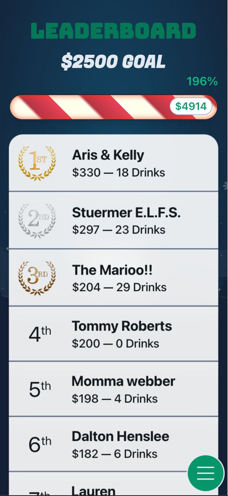

# DRINK 4 THE KIDS 2023 v2.0 [(Website)](https://d4k2k23.web.app/)

### *A web app to help celebrate the 4th annual D4K charity party.* 

All proceeds went directly to The Nicholas House and Bethany Haven Shelter charities.
  
This year's goal was to raise $2,500 and we more than doubled that goal with a grand total of **$5,636!** raised. With corporate matches, we were able to donate nearly **$15,000** total.

# Demo 

## Menu
- Displays all available drink options
- Redirects to Order Page with drink preselected

## Order
- Stores username in local storage after order is submitted
- Has front and backend validation to prevent incomplete/incorrect submissions
- Allows for users to submit donations 
- Calculates user's total and saves to database
- Redirects to Queue after order is submitted

## Queue
- Shows what drinks are being worked on and where a user is in line
- If a user's order is 3rd in line or later, allows a user to delete their order

## Mobile Leaderboard
- Shows goal (*$2500*), current total, and percentage of goal hit
- Automatically refreshes every 30 seconds

## Large Leaderboard
- Displayed on tv at party
- Shows goal (*$2500*), current total, and percentage of goal hit
- Automatically refreshes every 30 seconds

## Closing Tabs
- Aggregates user's orders and donations to a grand total
- Auto-populates amount, username, and active order details for the user 
- Allows user to pay with 3 different payment methods (CashApp, PayPal, Venmo)

# Admin Pages

## Orders
- Shows orders sorted by when they were submitted
- Allows for admins to change order status in the database (complete/incomplete/paid/unpaid)
- Admins can void orders or update tip amounts

## Tabs
- Shows tab information for everyone at the party, grouped by username
- Allows for admins to adjust overall donations on a user' tabs
- Can mark tabs as paid and set a user's tab to $0

## Analytics
- Periodically queries the database to keep an accurate count of drink and ingredient totals

